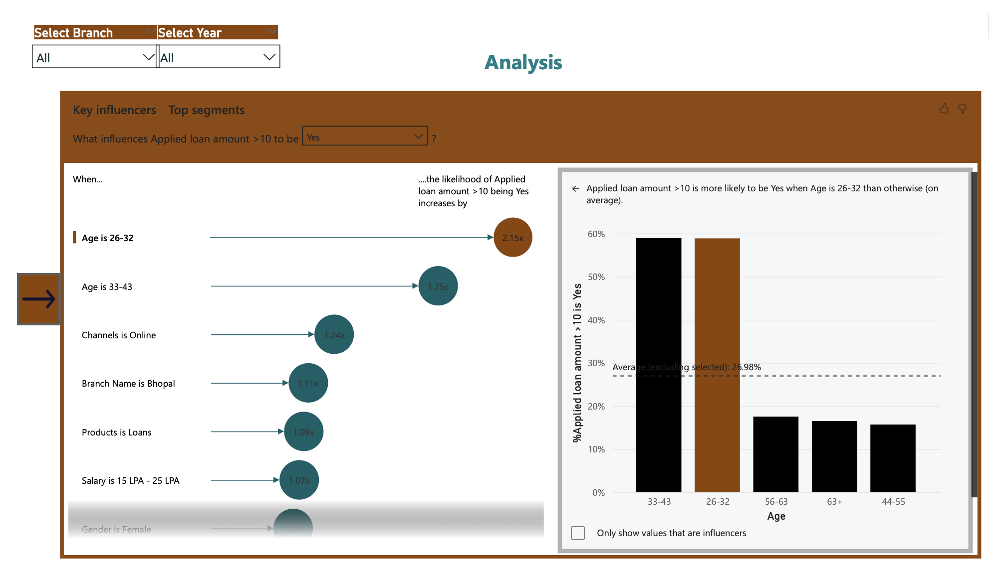
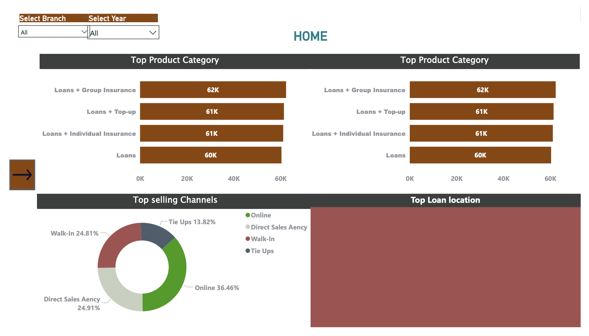
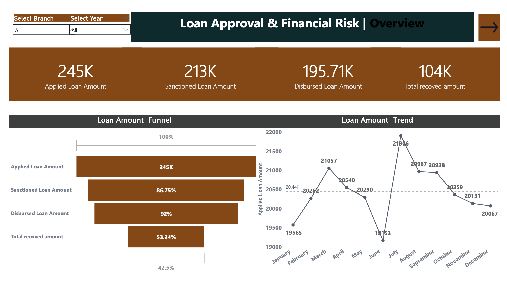

# Visual-Analytics-of-Loan-Behavior-and-Credit-Metrics
by Shruti

This Power BI dashboard was developed to explore and analyze key trends in a bank’s loan portfolio. It delivers an interactive overview of loan approvals, borrower demographics, repayment performance, and associated credit risk. Designed for clarity and functionality, the dashboard offers a dynamic experience for business users, interns, and analysts interested in lending behavior and financial health patterns.

  

Objective-
The primary goal of this project is to visually demonstrate how variables such as borrower income, debt-to-income ratio (DTI), loan purpose, and verification status influence loan outcomes. The report enables users to identify approval patterns, repayment challenges, and risk indicators by examining data across borrower segments and timeframes. Through carefully selected visuals, the dashboard highlights both macro and micro-level lending insights.

  

Dataset-
The dataset comprises approximately 1,000 records from a structured bank loan file in CSV format. Key fields include:
Loan ID, loan amount, issue date, and loan status
Annual income, interest rate, and DTI
Credit grade and sub-grade
Home ownership, state, and verification status
Purpose of the loan and total amount repaid
These variables were selected to support both high-level summary metrics and deeper, segmented analysis of risk and performance.

  

Dashboard Features-

KPI Cards summarizing total loan applications, disbursed amounts, payments received, average interest rates, and average DTI.
Time-series visuals displaying loan status trends across multiple years to uncover changes in approval or default behavior.
Demographic filters including slicers for state, loan purpose, credit grade, and home ownership, allowing users to drill down into specific borrower profiles.
Risk analysis visuals that compare DTI and interest rates across different loan grades and sub-grades.
Purpose-based segmentation to evaluate how different borrowing reasons correlate with repayment success or failure.

Tools Used--
The dashboard was built using Power BI Web (browser-based version), making it fully accessible on macOS. DAX was used for metric calculations such as percentage values and average aggregations. The report layout includes a mix of bar charts, KPI tiles, scatter plots, donut charts, and treemaps to present diverse perspectives on the data.

Key Findings--
Verified borrowers were less likely to default compared to those who were not verified.
DTI values were noticeably higher in defaulted loans, indicating stronger repayment risk.
Interest rates increased as credit grade decreased, reflecting stricter pricing for higher-risk borrowers.
Certain states showed significantly higher charge-off rates, pointing to potential regional lending concerns.

Usage--
This report was developed as part of a business analytics and data visualization portfolio to support internship and job applications in analyst roles. The original .pbix file can be opened using Power BI Desktop on Windows. For Mac users, the report is accessible via Power BI Service once published.

Personal Note--
This project reflects a practical understanding of business intelligence principles, from data preparation to visual storytelling. It demonstrates the ability to convert raw financial records into meaningful insights that support data-driven decision making. The dashboard emphasizes clean design, interactivity, and clarity, aligning with industry expectations for real-world BI deliverables.
